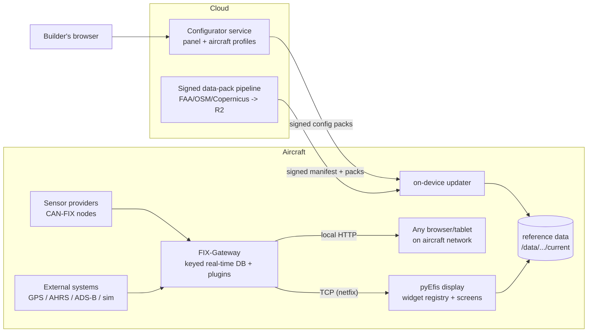

# AC-DP-001 — Defensive Publication: An Integrated Open-Source Avionics Architecture with Provider-Based Extensibility, Visual Configuration, and Cloud-Assisted Data Currency

<!-- SPDX-License-Identifier: CC-BY-4.0 -->

**Document type:** Defensive publication (prior-art disclosure)
**Authors:** Bill Mallard / AeroCommons contributors
**License:** Creative Commons Attribution 4.0 International (CC BY 4.0)
**Status:** DRAFT for review before TDCommons submission
**First public disclosure of the underlying work:** incrementally, 2013–2026, in the public repositories github.com/makerplane/pyEfis, github.com/makerplane/FIX-Gateway, github.com/billmallard/pyEfis, github.com/billmallard/makerplane-data, and at navdata.aerocommons.org / pyefis.aerocommons.org. This document consolidates and generalizes those disclosures.

---

## Abstract

This publication discloses the architecture of an integrated, open-source
avionics system for experimental and light-sport aircraft comprising: (1) a
data-bus-centric runtime in which all flight, engine, and navigation data
flows through a keyed real-time database (the FIX database) fed by
pluggable source providers over a CAN bus protocol (CAN-FIX) or network
transports; (2) an electronic flight instrument system (EFIS) whose screens
are assembled declaratively from a registry of composable instrument
widgets; (3) a web-based visual configurator through which a builder
designs instrument panels and aircraft parameter profiles in a browser,
with device-faithful live previews, and delivers the resulting
configuration to the aircraft as signed, versioned artifacts; (4) a
gateway-as-webserver capability in which the aircraft's data hub serves
its own status and configuration locally and, when connectivity exists,
synchronizes with a cloud service; (5) a signed data-pack pipeline that
keeps navigation reference data (airports, navaids, airways, obstacles,
terrain, water, roads) current on the device with cryptographic
verification and atomic installation; and (6) a general provider model —
a uniform contract for adding data sources, map layers, instruments,
engine/fuel-system parameter templates, and reference-data packs from
independent third parties, including proprietary ones, across stable
permissively-licensed interfaces. Variations and generalizations of each
mechanism are enumerated to place both the implementations and their
foreseeable alternatives in the public domain as prior art.

## 1. System overview

Two contracts partition the system: the **runtime contract** (the FIX
database key set; CAN-FIX parameter IDs) and the **reference-data
contract** (a signed manifest naming versioned data packs). Every
extension point below is defined against one of these contracts, never
against another component's internals.

## 2. Aircraft configurator (parameter profiles on the bus)

A web application in which a builder describes the *aircraft* — not the
panel — and the system compiles that description into bus/gateway
configuration:

* **Data model.** An aircraft profile is a versioned document (one active
  version per project) containing: V-speeds (Vso, Vs1, Vfe, Vno, Vne, Va,
  Vx, Vy, glide) with a unit selector (kt/mph/kph); gauge band definitions
  (min/max/warn/alarm ranges) per engine parameter; and **provider-based
  subsystem descriptions** — an engine provider (make/model template
  expands to per-cylinder CHT/EGT channels, oil, fuel-flow, RPM, manifold
  pressure, with multiplicity up to radial engines' cylinder counts), a
  fuel-system provider (tanks with roles — main/aux/header/tip — capacities,
  and a feeds graph describing which tank feeds which pump/engine), and
  future electrical/prop/gear providers under the same pattern.
* **Compilation.** The profile compiles to the data hub's initialization
  format (key/aux-key = value assignments, e.g. `IAS.Min`, `OILP1.highWarn`,
  `CHT12.Max`), delivered to the aircraft as a config artifact; the hub
  restarts or hot-reloads to apply. The same profile can equally compile to
  CAN-FIX node configuration frames, an ARINC-825 profile, or any other
  bus dialect — the profile is bus-agnostic; compilers are per-target.
* **Templates.** Named templates (e.g. Lycoming O-320/O-360, Continental
  O-470) pre-fill bands from type-certificate data; builders adjust and the
  delta persists. Template libraries may be first- or third-party.
* **Node diagram (disclosed design).** The profile generalizes to a graph
  editor of aircraft *nodes* (sensors, buses, displays, effectors) whose
  edges are data flows; validation detects multiple writers of one key,
  missing sources, and unit mismatches at design time.

## 3. Instrument configurator (visual panel design)

* **Decomposition.** Every instrument is a widget in a registry keyed by
  type name, with a declared option schema (typed properties: numbers,
  percentages, booleans, enums, colors, FIX keys) and default data
  bindings. The registry is exported (schema.json) so any front-end can
  enumerate the catalog without running the EFIS.
* **Assembly.** Screens are declarative documents placing instruments on a
  normalized grid (rows x columns independent of pixel size), so one
  design renders correctly across display geometries. The same widget set
  composes into a PFD, an EMS cluster, an MFD, or any hybrid; element
  groups (e.g. a per-cylinder CHT/EGT cluster) place as one unit and
  expand by engine multiplicity from the aircraft profile.
* **Device-faithful preview.** The browser renders each widget with a
  "twin" that reproduces the device's drawing logic (ported code or
  data-driven rendering from real terrain/chart patches), so what the
  builder sees is what the aircraft displays — including synthetic-vision
  previews rendered from real elevation data at representative poses.
* **Persistence & delivery.** Designs serialize to human-readable YAML,
  are versioned server-side, and are delivered to the device as part of a
  signed configuration pack (§5). Two-way editing (canvas ↔ text) is
  supported.

## 4. Moving map

A top-down navigation display implemented as a plain widget (no GPU
dependency) with:

* a single projection owner (azimuthal-equidistant around ownship;
  track-up or north-up; range defined anchor-to-top-edge; configurable
  ownship anchor point);
* a **layer provider registry** (z-ordered; per-layer enable, async
  collection off the UI thread with latest-wins snapshots, synchronous
  paint): terrain (hypsometric tinting + hillshade from the same elevation
  tiles the synthetic vision uses, with a terrain-caution mode coloring
  cells by height relative to ownship), airports (chart-style symbology
  with true-orientation runway strips, grid-based declutter), navaids/
  fixes/airways from a cyclically-updated database, range rings, and
  future layers (traffic, weather, airspace, flight plan) via the same
  contract;
* range-ladder stepping, orientation toggle, and layer toggles exposed as
  HMI actions bindable to hardware controls;
* split-screen/MFD composition by placing the map widget in any screen
  design like any other instrument.

## 5. Gateway-as-webserver and cloud-assisted configuration

* **Local.** The aircraft's data hub (or a sidecar process speaking its
  TCP protocol) serves an HTTP interface on the aircraft's local network:
  live values, health/status, configuration inspection, and controlled
  writes. Any browser or tablet on the aircraft Wi-Fi is a maintenance
  terminal; no installed app. Auth ranges from open (isolated network) to
  token/mTLS.
* **Cloud, when connected.** The same device pairs once with a cloud
  service via a claim code, receives a scoped device token, and thereafter
  **pulls** (never accepts unsolicited pushes of) its owner's latest
  configuration: panel designs, aircraft profiles, calibration. Artifacts
  are signed; the device verifies before applying; application is atomic
  with rollback (the prior version is retained).
* **Data paths.** Local and cloud paths are the same artifact format —
  a config pack usable from USB with no connectivity at all. Disclosure
  covers pull-based, push-notified-then-pull, and store-and-forward
  (via the builder's phone) delivery variants.

## 6. Signed reference-data currency

* A build pipeline fetches upstream sources (FAA NASR/DOF/CIFP cycles —
  including multi-archive products merged into one build input; OSM;
  Copernicus terrain), builds self-describing packs (embedded metadata:
  id, kind, cycle, effective/expiry dates, attribution), signs a manifest
  (ed25519) enumerating each pack's hash, and publishes to zero-egress
  object storage on a daily idempotent schedule keyed to the 28/56-day
  AIRAC grid, building current and next cycles ahead of effectivity.
* The on-device updater trusts only an embedded public key; downloads to
  staging; verifies hashes; installs atomically (symlink flip); pre-stages
  the next cycle and flips it into effect by date with no download at the
  boundary; selection is by pack, kind, or region with storage budgeting;
  offline import from removable media uses the identical verification.
* The EFIS **informs, never restricts**: currency states (current/
  update-available/expires-soon/expired/missing) surface as subtle
  annunciations and a boot status screen with one-tap update; stale data
  never disables a display.

## 7. The provider model (general contract)

The unifying pattern, applied at every extension surface:

1. a **registry** (map layers; instrument types; pack kinds; engine/fuel
   templates; gateway source plugins; airport-data providers) into which
   implementations register a type key, metadata, and capabilities;
2. a **normalization boundary** — providers emit data in the contract's
   normalized form (FIX keys with quality flags; lat/lon/elevation
   records; sqlite packs of declared schema) so consumers are
   provider-agnostic;
3. **discovery** by configuration or filesystem convention (e.g. every
   `<dir>/*/current/<kind>.sqlite` is merged at runtime, deduplicated by
   identifier with priority ordering);
4. **independent deployment** — a provider ships as its own pack, plugin,
   process, or hardware node; in-process providers inherit the host's
   license, out-of-process providers (bus/TCP/HTTP/file boundary) may be
   proprietary;
5. **quality/arbitration semantics** at the boundary: per-key quality
   flags (old/bad/fail), and disclosed variations including priority
   ordering, automatic failover between redundant providers, voting,
   health monitoring with annunciation, per-key source selection tables,
   and a simulation/flight interlock that segregates simulated sources
   from live-flight keys.

## 8. Alternatives and generalizations (explicitly disclosed)

For each mechanism above, the following variations are also disclosed as
prior art:

* **Transports:** CAN-FIX over CAN 2.0/CAN-FD; the keyed-database protocol
  over TCP, WebSocket, serial, Bluetooth, or shared memory; MQTT-style
  pub/sub topics mapping one-to-one onto database keys.
* **Registries:** static registration at import, entry-point/plugin
  discovery, manifest-declared providers, remotely-fetched signed
  provider catalogs (an "instrument store"), per-aircraft allow-lists.
* **Preview fidelity:** ported drawing code, shared rendering libraries
  compiled to WebAssembly, server-side rendering of the real widget with
  image streaming, and recorded-frame comparison harnesses that enforce
  twin fidelity in CI.
* **Config delivery:** signed packs over HTTPS pull; USB; QR-coded diffs;
  mesh/store-and-forward via a companion app; A/B partition application;
  staged rollout with device-side canary checks.
* **Data packs:** sqlite, flat binary tiles, or mbtiles containers;
  region- or layer-split packs; delta packs against a prior cycle;
  provider-merged multi-source packs with per-record provenance.
* **Arbitration:** last-writer-wins, priority tables, quality-weighted
  selection, dual-channel comparison with miscompare annunciation,
  time-limited manual overrides.
* **Webserver placement:** in the gateway process, as a sidecar over the
  TCP protocol, on a separate maintenance computer, or in the display
  itself; local-only, cloud-relayed, or both.

## 9. Prior public record

The implementations summarized here are published, with full source and
dated commit history, at: github.com/makerplane/pyEfis and
github.com/makerplane/FIX-Gateway (Phil Birkelbach et al., 2013–present;
GPL-2.0-or-later); github.com/billmallard/pyEfis (SVS, moving map,
instrument registry/editor extensions, 2026); and
github.com/billmallard/makerplane-data (data-pack pipeline, on-device
updater, configurator service, 2026; Apache-2.0/AGPL-3.0). Design
documents predating implementation (moving map, aircraft configurator,
node diagram, gateway webserver) are committed in those repositories'
`docs/` trees. Live services: navdata.aerocommons.org (signed pack
catalog), pyefis.aerocommons.org (configurator).

*The CAN-FIX protocol itself is the work of Phil Birkelbach
(github.com/birkelbach/canfix-spec, 2013–present) and is expected to be
the subject of its own disclosure by its author; this document discloses
the integration architecture built around it.*
